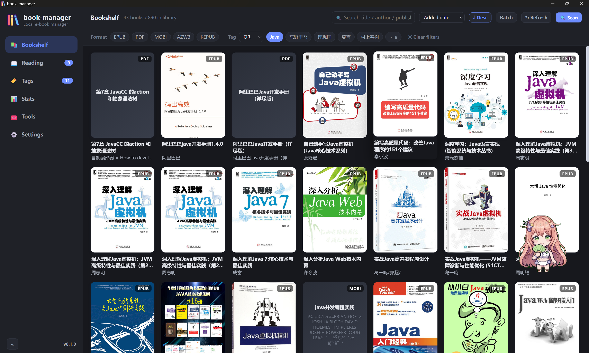
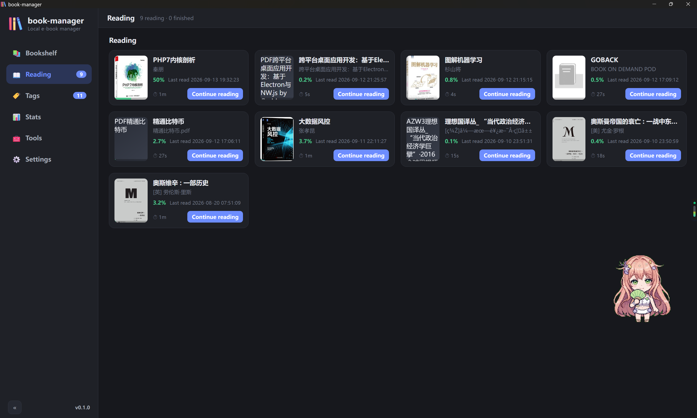
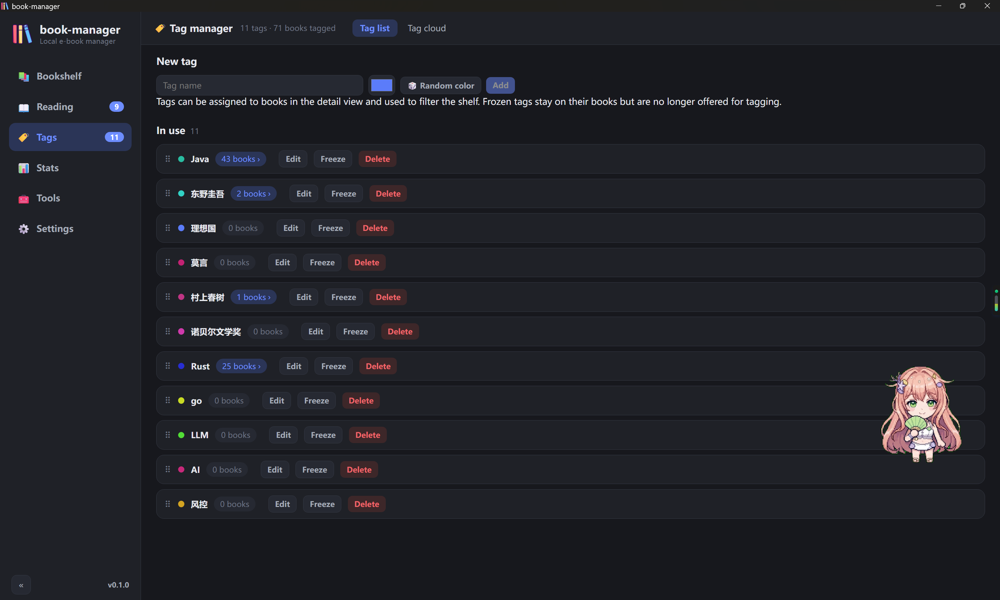
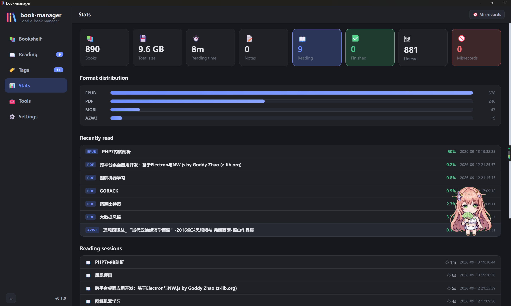
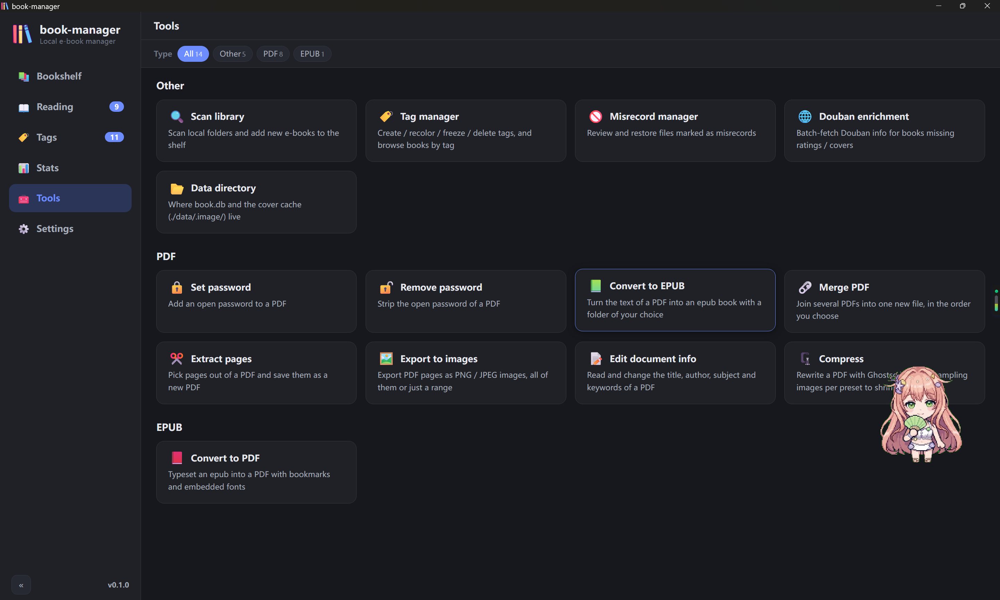
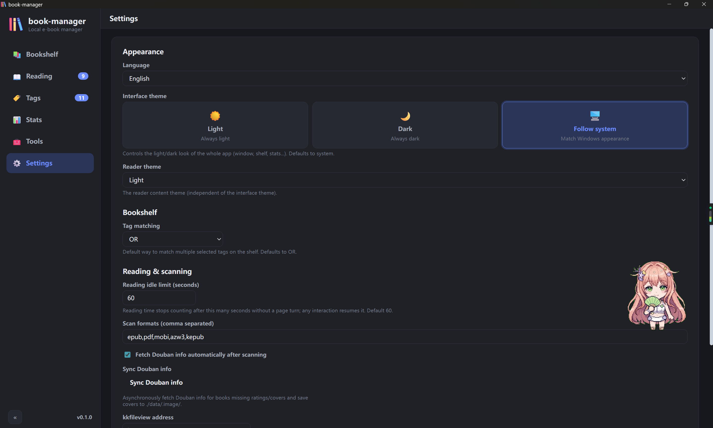

# Book Manager · Local e-book library (Windows, macOS, Linux)

**[English](README.md)** · [简体中文](README.zh-CN.md) · [繁體中文](README.zh-TW.md)

    

A local-first e-book manager built with Wails v2, Go and React. Point it at your folders, keep the shelf tidy with tags, read epub / pdf / mobi right inside the app, and clean up your PDFs with fourteen built-in tools — nothing ever leaves your disk, everything lives in a single SQLite file.



## Features

- **📂 Folder scanning** — Scan local folders and pull out title, author, publisher, language, description, size and MD5, plus the cover art. EPUB, PDF, MOBI, AZW3 and KEPUB are supported.
- **📚 Bookshelf** — A cover grid with keyword search, format filter, multi-tag «or / and» filtering and several sort orders; cards show reading progress and the Douban rating, and the scroll position is remembered.
- **🏷️ Tags** — Create, rename, recolor, freeze or delete tags, drag them into your own order, roll a random color, or browse them as a tag cloud whose size follows the book count.
- **🌐 Douban metadata** — Fetch covers, links, ratings and rating counts from Douban by title — in batches, or one book at a time from the detail dialog.
- **📖 Built-in reader** — EPUB / KEPUB through epub.js, PDF through pdf.js, and MOBI / AZW3 with a built-in PalmDoc decoder that renders the embedded images too. Position, page count and progress are recorded per book, and encrypted PDFs ask for the password once.
- **🔤 Comfortable reading** — Change the font size from the reader toolbar and flip on eye-care mode for a warm page; both are session-local, so your global settings stay untouched.
- **⏱️ Reading timer** — Every session adds to the total reading time. Staying on one page only counts one minute, and that idle cap is configurable in Settings.
- **📝 Notes** — Select any text while reading to attach a note with its quote and position; notes can be reviewed and deleted later.
- **🧰 Fourteen tools** — Passwords, merge, page extraction, metadata, compression, PDF → EPUB, EPUB → PDF and image export — all offline, all on your own files.
- **🚫 Misrecords** — Mark a mis-detected file as a misrecord and the next scan skips it by path and MD5; restore it whenever you like.
- **📊 Stats** — Totals for books, size, reading time and notes, the format breakdown, the latest additions and the full list of reading sessions.
- **🌏 Three languages** — The interface ships in English, Simplified Chinese and Traditional Chinese.
- **💾 Local-first** — No account, no cloud, no telemetry — one SQLite file next to the executable.
- **🖥️ Tray and single instance** — Closing the window keeps the app in the system tray, and starting it again simply reopens the window that is already there.

## Screenshots

### Bookshelf


Cover grid, search, format and tag filters, batch actions.

### Reading



Unfinished and finished books, one click to continue.

### Tags



Drag to reorder the list, or switch to the tag cloud.

### Stats



Reading time, format breakdown and the session log.

### Tools



Fourteen utilities on one page.

### Settings



Shelf defaults, idle cap, language and data location.

## Fourteen built-in tools

Everything runs offline, on files you pick — including the PDFs already on your shelf.

### PDF

- **🔒 Set password** — Set an open password on a PDF.
- **🔓 Remove password** — Remove the open password from a PDF.
- **🧷 Merge PDFs** — Merge several PDFs into one new file, in order.
- **✂️ Extract pages** — Pick pages out of a PDF and save them as a new PDF.
- **🖼️ Export images** — Save PDF pages as PNG / JPEG images, optionally only the pages you name.
- **📝 Edit metadata** — View and edit the title, author, subject and keywords of a PDF.
- **🗜️ Compress** — Rewrite a PDF with Ghostscript, downsampling images per preset to shrink it.
- **📗 PDF → EPUB** — Lay out the text layer of a PDF as an epub, with an optional output folder.

### EPUB

- **📕 EPUB → PDF** — Lay out an epub as a PDF with a bookmark outline, embedded fonts and selectable text.

### Other

- **🔍 Scan library** — Scan local folders and add new e-books to the shelf.
- **🏷️ Manage tags** — Create, recolor, freeze and delete tags; browse books by tag.
- **🚫 Misrecords** — Review and restore files marked as misrecords.
- **🌐 Douban sync** — Batch-fetch Douban information for books missing ratings or covers.
- **📂 Data folder** — Where book.db and the cover cache live, with a button to open it.

## Quick start

### Requirements

- Go 1.21+
- Node.js 18+
- Wails CLI: `go install github.com/wailsapp/wails/v2/cmd/wails@latest`
- Windows: the WebView2 runtime (already part of Windows 10 / 11)
- macOS: unsigned build — run `xattr -dr com.apple.quarantine book-manager.app` on first launch
- Linux: `libwebkit2gtk-4.1` and `libgtk-3` (built on Ubuntu 24.04, glibc 2.39+)

### Handy commands (just)

```bash
just setup             # install the frontend dependencies
just dev               # dev mode with hot reload
just build             # production build → src/build/bin/book-manager.exe
just release           # release build → release/book-manager.exe
just test              # Go backend tests, JS parsers and the i18n check
just ui-test           # headless browser smoke test of the UI (needs Edge + playwright-core)
just icon              # regenerate the app icons from asserts/logo.png
just fmt               # gofmt and go vet the backend
just docs              # regenerate the READMEs and the docs site
just site-test         # render the docs site in a headless browser and check every link and image
just push "msg"        # commit everything and push to main
```

> Development conventions live in agents.md — every session ends with a commit and a push.

## Data storage

- Database: `<data dir>/book.db` — SQLite, pure Go, override the directory with the `BOOKMANAGER_DATA_DIR` environment variable.
- Cover cache: `<data dir>/covers/` and `<data dir>/.image/`.
- The data directory is resolved next to the executable first (release/data), then the working directory, then the user config directory.
- No user data is committed: src/data/, src/build/bin and release/ are git-ignored.

## Known issue (Windows only): blank window (WebView2 stops repainting)

In production builds (with the assets embedded) some WebView2 + GPU combinations stop repainting because of the Wails hide / show visibility workaround — the window shows nothing but its background colour. The workaround lives in src/platform_windows.go:

```go
app.Windows = &windows.Options{
    WebviewGpuIsDisabled: true, // --disable-gpu; harmless for a text app
    WebviewUserDataPath: resolveWebviewUserDataPath(dataDir),
},
```

To diagnose this, build with `wails build -debug` to get DevTools, or attach a debugger with `WEBVIEW2_ADDITIONAL_BROWSER_ARGUMENTS=--remote-debugging-port=9333`.

## Version

- Current version: **v0.1.0**
- Single source of truth: the `Version` constant in `src/version.go`.
- Shown in the sidebar footer and the settings dialog through the App.GetVersion() binding.
- To release: bump `src/version.go` and push — GitHub Actions builds the Windows / macOS / Linux packages and creates the release. `just release` only builds the local Windows exe.

## Download

Every release ships portable packages for three platforms, built by GitHub Actions and published with the commit log as its release notes: a single exe for Windows (`book-manager-<version>-windows-x64.zip`), a universal app for macOS (`...-macos-universal.zip`) and a tarball for Linux x64 (`...-linux-x64.tar.gz`). Unzip, run, and the app creates its data folder next to itself.

- [Get the latest release](https://github.com/freewu/book-manager/releases/latest)
- [Or browse all releases on GitHub](https://github.com/freewu/book-manager/releases)

## License

MIT © 2026 bluefrog · [https://github.com/freewu/book-manager](https://github.com/freewu/book-manager)
